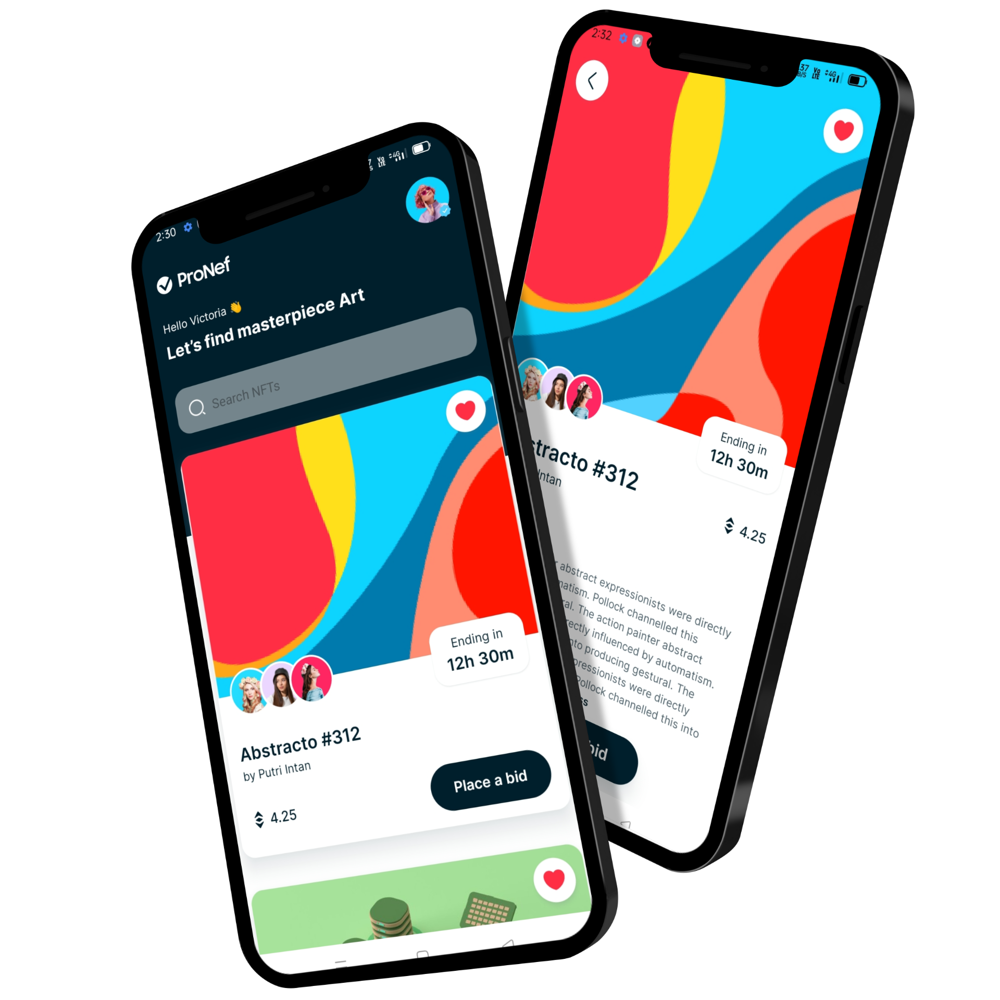
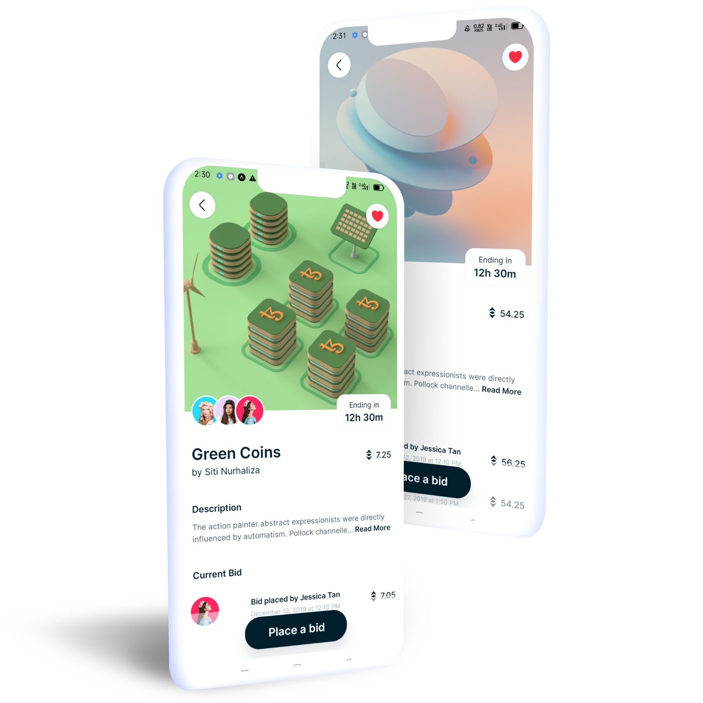

# NFT Marketplace

Welcome to NFT Marketplace, the ultimate mobile gateway to the world of NFTs! Our innovative app, built with React Native and Expo, brings the exciting realm of non-fungible tokens directly to your fingertips.

**Key Features:**
 - **Search Functionality:** Seamlessly explore the vast universe of NFTs with our robust search functionality. Effortlessly find your favorite digital collectibles, artworks, and more.
 - **Detailed NFT Views:** Dive deeper into the stories behind each NFT.
 - **User-Friendly Interface:** Our app boasts a sleek and user-friendly interface designed to enhance your NFT experience.
 - **Expo-Powered Performance:** Leveraging the power of React Native and Expo, our app delivers a smooth and responsive user experience. Enjoy the benefits of cross-platform development without compromising on performance or functionality.

## App Video Review

<a href='https://clipchamp.com/watch/CoHmSmYuKvZ/embed' target='_blank'>Click here and view the video</a>

## App Image Review

